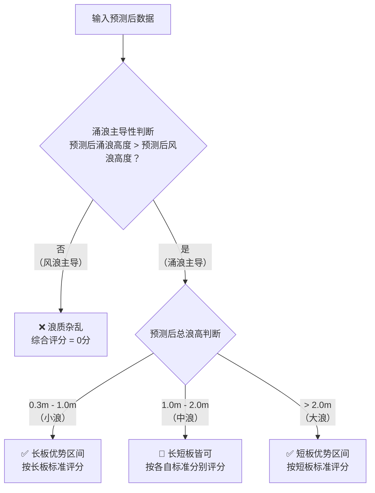

# 🏄 浪点评分标准说明 (科学决策版 - 基于预测后数据)

## 📊 评分系统概述

本系统采用**多维度浪况评估模型**，**直接基于您内嵌模型预测处理后的Windy数据**，通过分析**总浪高、涌浪分量、风浪分量**的相互关系，为长板和短板冲浪提供科学评分。

> **核心前提**：所有输入本评分系统的数据，均已通过您的专业内嵌模型进行地形、海床、能量衰减等本地化因素校准，是**可直接用于冲浪评估的预测后数据**。

---

## 🎯 核心评分逻辑 (基于预测后数据)

### 浪质纯净度评估

首先判断预测后的浪况是否由纯净的涌浪主导：



### 浪质纯净度计算公式

```javascript
function calculateWaveQuality(swellHeight, windWaveHeight) {
    // 风浪主导 = 直接返回0分
    if (windWaveHeight >= swellHeight) {
        return 0;
    }
    
    // 涌浪主导 = 计算纯净度系数
    const purityRatio = swellHeight / (swellHeight + windWaveHeight);
    
    // 纯净度系数影响最终评分
    return purityRatio; // 0.5 - 1.0 之间
}
```

---

## 🏄♂️ 长板冲浪评分标准 (优化版)

### **适用条件**
- **涌浪主导**: 涌浪高度 > 风浪高度
- **浪高范围**: 0.3m - 1.5m (预测后数据)
- **最佳浪高**: 0.5m - 1.0m

### **评分计算公式**
```javascript
function scoreLongboard(totalWaveHeight, swellHeight, windWaveHeight) {
    // 1. 浪质检查
    const waveQuality = calculateWaveQuality(swellHeight, windWaveHeight);
    if (waveQuality === 0) return 0;
    
    // 2. 浪高评分
    const heightScore = scoreWaveHeight(totalWaveHeight, {
        min: 0.3,
        max: 1.5,
        optimalMin: 0.5,
        optimalMax: 1.0
    });
    
    // 3. 综合评分 = 浪高评分 × 浪质系数
    return heightScore * waveQuality;
}
```

### **长板评分曲线 (考虑浪质)**
```
评分
1.0 |     ████████         (纯净涌浪)
0.8 |   ██        ██       
0.6 | ██            ██     ▓▓▓▓▓▓▓▓ (混合浪况)
0.4 |█                █    ▓▓      ▓▓
0.2 |                  █   ▓▓        ▓▓
0.0 |___________________█__▓▓__________▓▓
    0.3  0.5   1.0   1.5  浪高(m)
         ↑最佳范围↑
```

---

## 🏄♀️ 短板冲浪评分标准 (优化版)

### **适用条件**
- **涌浪主导**: 涌浪高度 > 风浪高度  
- **浪高范围**: 0.8m - 3.5m (预测后数据)
- **最佳浪高**: 1.2m - 2.5m

### **评分计算公式**
```javascript
function scoreShortboard(totalWaveHeight, swellHeight, windWaveHeight) {
    // 1. 浪质检查
    const waveQuality = calculateWaveQuality(swellHeight, windWaveHeight);
    if (waveQuality === 0) return 0;
    
    // 2. 浪高评分
    const heightScore = scoreWaveHeight(totalWaveHeight, {
        min: 0.8,
        max: 3.5,
        optimalMin: 1.2,
        optimalMax: 2.5
    });
    
    // 3. 大浪奖励系数 (2.0m以上)
    const bigWaveBonus = totalWaveHeight > 2.0 ? 1.1 : 1.0;
    
    // 4. 综合评分 = 浪高评分 × 浪质系数 × 大浪奖励
    return Math.min(1.0, heightScore * waveQuality * bigWaveBonus);
}
```

### **短板评分曲线 (考虑浪质)**
```
评分
1.0 |         ████████████     (纯净涌浪 + 大浪奖励)
0.8 |       ██            ██   
0.6 |     ██                ██ ▓▓▓▓▓▓▓▓▓▓▓▓ (混合浪况)
0.4 |   ██                    ██▓▓          ▓▓
0.2 | ██                        ██            ▓▓
0.0 |█____________________________█____________▓▓
    0.8   1.2      2.5      3.5  浪高(m)
           ↑最佳范围↑        ↑大浪奖励区↑
```

---

## 🧮 通用评分函数

### **浪高评分函数**
```javascript
function scoreWaveHeight(waveHeight, criteria) {
    const { min, max, optimalMin, optimalMax } = criteria;
    
    // 超出范围 = 0分
    if (waveHeight < min || waveHeight > max) return 0;
    
    // 最佳范围 = 1.0分
    if (waveHeight >= optimalMin && waveHeight <= optimalMax) return 1.0;
    
    // 渐变评分
    if (waveHeight < optimalMin) {
        return (waveHeight - min) / (optimalMin - min) * 0.8;
    } else {
        return (max - waveHeight) / (max - optimalMax) * 0.8;
    }
}
```

### **评级转换表**
| 评分范围 | 评级 | 颜色标识 | 推荐文案 |
|----------|------|----------|----------|
| 80 - 100 | Excellent | 🟢 绿色 | 完美条件 - 纯净涌浪 |
| 60 - 79 | Good | 🔵 蓝色 | 良好条件 - 涌浪主导 |
| 40 - 59 | Fair | 🟡 黄色 | 一般条件 - 轻微混合 |
| 20 - 39 | Poor | 🔴 红色 | 条件较差 - 浪质杂乱 |
| 0 - 19 | Flat/Messy | ⚫ 灰色 | 不适合冲浪 |

---

## 📈 智能推荐逻辑

### **浪况分区推荐**
```javascript
function getRecommendation(totalWaveHeight, swellHeight, windWaveHeight) {
    // 浪质检查
    if (windWaveHeight >= swellHeight) {
        return {
            longboard: 0,
            shortboard: 0,
            message: "风浪主导，浪质杂乱，不适合冲浪"
        };
    }
    
    // 分区推荐
    if (totalWaveHeight <= 1.0) {
        // 小浪区间 - 长板优势
        return {
            longboard: scoreLongboard(totalWaveHeight, swellHeight, windWaveHeight),
            shortboard: Math.max(0, scoreShortboard(totalWaveHeight, swellHeight, windWaveHeight) * 0.6),
            primary: "longboard",
            message: "小浪条件，推荐长板冲浪"
        };
    } else if (totalWaveHeight <= 2.0) {
        // 中浪区间 - 长短板皆可
        return {
            longboard: scoreLongboard(totalWaveHeight, swellHeight, windWaveHeight),
            shortboard: scoreShortboard(totalWaveHeight, swellHeight, windWaveHeight),
            primary: "both",
            message: "中等浪况，长短板皆可选择"
        };
    } else {
        // 大浪区间 - 短板优势
        return {
            longboard: Math.max(0, scoreLongboard(totalWaveHeight, swellHeight, windWaveHeight) * 0.4),
            shortboard: scoreShortboard(totalWaveHeight, swellHeight, windWaveHeight),
            primary: "shortboard", 
            message: "大浪条件，推荐短板冲浪"
        };
    }
}
```

---

## 🔍 实际案例分析 (优化版)

### **案例1: 青岛石老人 - 纯净小浪**

**预测后数据:**
- 总浪高: 0.8m
- 涌浪高度: 0.7m  
- 风浪高度: 0.1m

**评分计算:**
```javascript
// 浪质系数 = 0.7 / (0.7 + 0.1) = 0.875
// 长板浪高评分 = 1.0 (在最佳范围内)
// 长板综合评分 = 1.0 × 0.875 = 0.875 ≈ 0.88

// 短板浪高评分 = 0 (低于最小值0.8m)  
// 短板综合评分 = 0
```

**推荐结果:**
- 长板: 0.88分 (Excellent)
- 短板: 0分 (不适合)
- 推荐: "纯净小浪，完美的长板条件！"

### **案例2: 海南陵水 - 理想中浪**

**预测后数据:**
- 总浪高: 1.8m
- 涌浪高度: 1.6m
- 风浪高度: 0.2m

**评分计算:**
```javascript
// 浪质系数 = 1.6 / (1.6 + 0.2) = 0.889
// 长板浪高评分 = (1.5 - 1.8) / (1.5 - 1.0) × 0.8 = 0 (超出范围)
// 短板浪高评分 = 1.0 (在最佳范围内)
// 短板综合评分 = 1.0 × 0.889 = 0.889 ≈ 0.89
```

**推荐结果:**
- 长板: 0分 (超出范围)
- 短板: 0.89分 (Excellent)  
- 推荐: "纯净中浪，绝佳的短板条件！"

### **案例3: 混合浪况示例**

**预测后数据:**
- 总浪高: 1.2m
- 涌浪高度: 0.8m
- 风浪高度: 0.4m

**评分计算:**
```javascript
// 浪质系数 = 0.8 / (0.8 + 0.4) = 0.667
// 长板浪高评分 = (1.5 - 1.2) / (1.5 - 1.0) × 0.8 = 0.48
// 短板浪高评分 = 1.0 (在最佳范围内)
// 长板综合评分 = 0.48 × 0.667 = 0.32
// 短板综合评分 = 1.0 × 0.667 = 0.667
```

**推荐结果:**
- 长板: 0.32分 (Poor)
- 短板: 0.67分 (Good)
- 推荐: "涌浪主导但有风浪干扰，短板条件尚可"

---

## ⚙️ 数据输入要求

### **必需的预测后数据**
```javascript
const requiredData = {
    totalWaveHeight: 1.5,      // 总浪高 (m) - 预测后
    swellHeight: 1.3,          // 涌浪高度 (m) - 预测后  
    windWaveHeight: 0.2,       // 风浪高度 (m) - 预测后
    timestamp: "2024-11-16T12:00:00Z"
};
```

### **数据校准说明**
> **重要**: 本评分系统假设所有输入数据已经过以下校准：
> 1. **地形校准**: 考虑海湾开放度、地形遮挡等因素
> 2. **海床校准**: 考虑沙质、岩石、珊瑚礁等海床类型
> 3. **能量衰减**: 考虑海浪传播过程中的自然能量损失
> 4. **本地化修正**: 基于历史数据的地点特异性调整

---

## 🎯 推荐文案模板

### **长板推荐文案**
```javascript
const longboardMessages = {
    excellent: "🏄♂️ 完美的长板条件！纯净涌浪，平稳长浪，适合滑行走板",
    good: "🏄♂️ 不错的长板条件，涌浪主导，适合练习和休闲冲浪",
    fair: "🏄♂️ 一般条件，轻微风浪干扰，初学者可以尝试",
    poor: "⚠️ 浪质杂乱，不推荐长板冲浪",
    flat: "❌ 浪况不适合长板冲浪"
};
```

### **短板推荐文案**  
```javascript
const shortboardMessages = {
    excellent: "🏄♀️ 绝佳的短板条件！纯净涌浪，有力浪墙，适合激进动作",
    good: "🏄♀️ 良好的短板条件，涌浪主导，适合技术练习", 
    fair: "🏄♀️ 可以冲浪，但有轻微风浪干扰",
    poor: "⚠️ 浪质杂乱，短板冲浪体验不佳",
    flat: "❌ 浪况不适合短板冲浪"
};
```

---

## 📊 性能优化建议

### **计算优化**
1. **预计算浪质系数**: 避免重复计算涌浪/风浪比例
2. **缓存评分结果**: 相同输入数据可复用评分结果
3. **批量处理**: 多个时间点数据可批量计算

### **精度提升**
1. **周期因子**: 未来可考虑加入浪周期评估
2. **风向因子**: 考虑风向与浪向的关系
3. **潮汐因子**: 结合潮汐数据优化评分

---

## 🔧 调试和验证

### **调试输出格式**
```javascript
const debugOutput = {
    input: {
        totalWaveHeight: 1.5,
        swellHeight: 1.3, 
        windWaveHeight: 0.2
    },
    calculations: {
        waveQuality: 0.867,
        longboardHeightScore: 0.6,
        shortboardHeightScore: 1.0,
        bigWaveBonus: 1.0
    },
    results: {
        longboard: 0.52,
        shortboard: 0.87,
        recommendation: "shortboard",
        message: "涌浪主导的中等浪况，推荐短板冲浪"
    }
};
```

### **验证检查点**
- [ ] 风浪主导时评分为0
- [ ] 涌浪主导时正常评分  
- [ ] 最佳范围内评分接近1.0
- [ ] 超出范围时评分为0
- [ ] 浪质系数正确应用

---

## 📝 版本更新说明

### **v2.0 优化版特性**
- ✅ 多维度浪况评估 (总浪高 + 涌浪 + 风浪)
- ✅ 浪质纯净度判断
- ✅ 智能分区推荐逻辑
- ✅ 大浪奖励机制 (短板)
- ✅ 混合浪况降权处理
- ✅ 科学的评分算法

### **与v1.0的主要区别**
| 特性 | v1.0 (原版) | v2.0 (优化版) |
|------|-------------|---------------|
| 评估维度 | 仅总浪高 | 总浪高 + 涌浪 + 风浪 |
| 浪质判断 | 无 | 涌浪主导性检查 |
| 评分逻辑 | 单一曲线 | 多因子综合评分 |
| 推荐策略 | 固定标准 | 智能分区推荐 |
| 精确度 | 基础 | 科学化提升 |

---

*本评分标准基于海洋学原理和冲浪运动特性设计，旨在为冲浪爱好者提供更科学、更精准的浪况评估服务。*